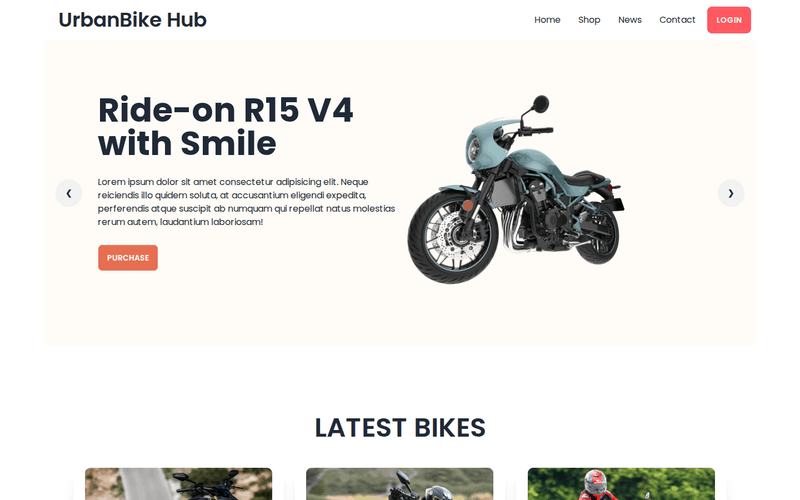
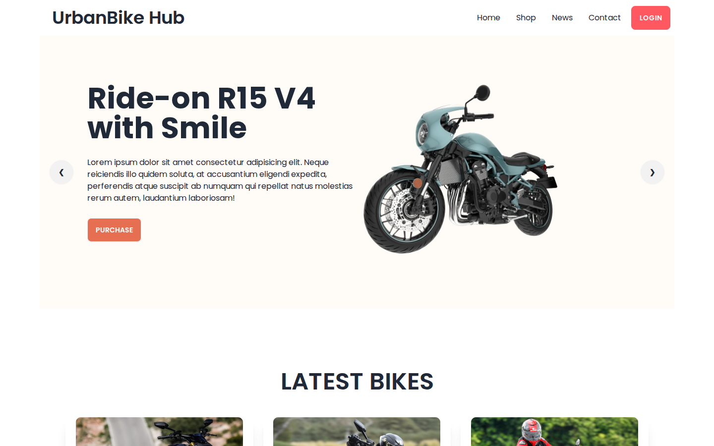
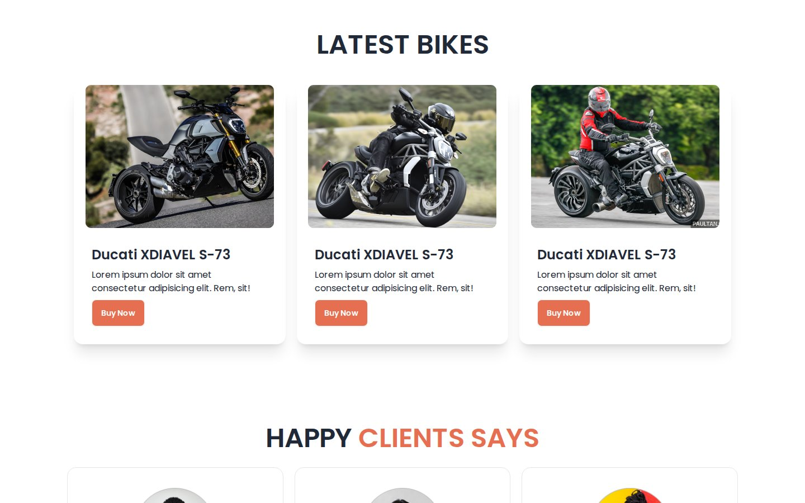
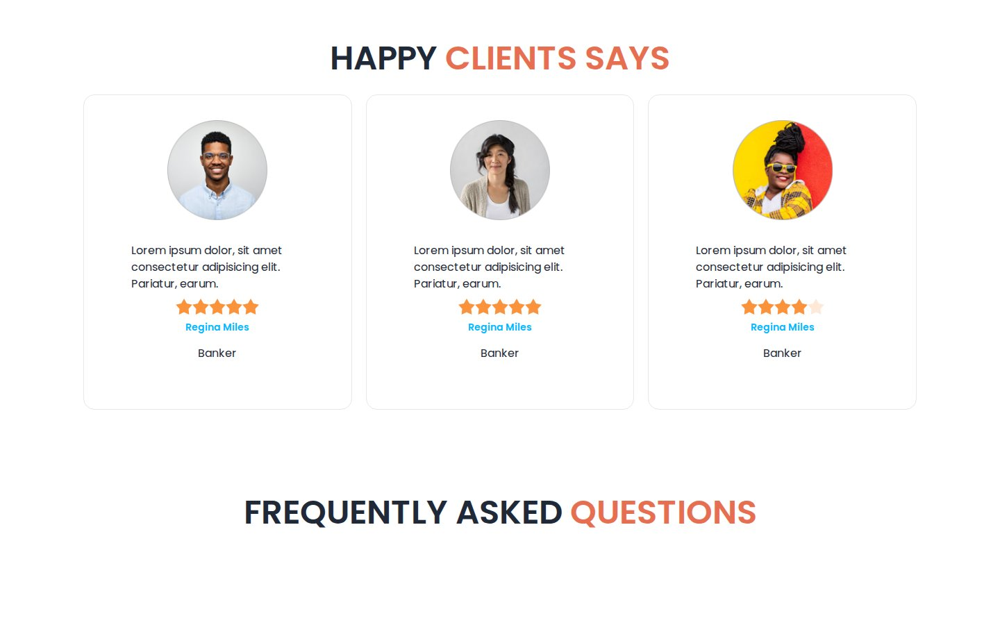
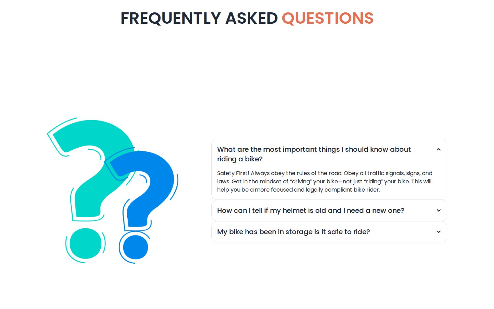

# UrbanBike Hub

A motorbike showroom landing page built with Tailwind CSS and DaisyUI: a bike carousel, the latest models, customer reviews and a rider FAQ.

**Live site:** <https://shayan-abrar.github.io/UrbanBike-Hub/>

<p align="center">
  
</p>

<table>
  <tr>
    <td align="center" width="25%"><a href="screenshots/preview.png"></a><br><sub><b>Hero</b> · carousel</sub></td>
    <td align="center" width="25%"><a href="screenshots/latest-bikes.jpg"></a><br><sub><b>Latest bikes</b></sub></td>
    <td align="center" width="25%"><a href="screenshots/clients.jpg"></a><br><sub><b>Reviews</b> · star ratings</sub></td>
    <td align="center" width="25%"><a href="screenshots/faq.jpg"></a><br><sub><b>FAQ</b> · accordion</sub></td>
  </tr>
</table>

A showroom's home page has to show its bikes first and then answer the questions buyers ask. This page does that with DaisyUI components (a carousel, cards, star ratings and an accordion) arranged with Tailwind utilities. Apart from a short Tailwind config, it has no JavaScript of its own, which makes it a compact reference for building a landing page from ready-made components.

## Quick Start

```bash
git clone https://github.com/SHAYAN-ABRAR/UrbanBike-Hub.git
cd UrbanBike-Hub
python3 -m http.server 8000
```

Open <http://localhost:8000>. On Windows, use `python` instead of `python3`. Opening `index.html` directly in a browser works too. Tailwind CSS, DaisyUI and the Poppins font load from the internet.

## Features

- **Hero carousel:** four slides with different bike photos, a **Purchase** button and ❮ ❯ arrows. The arrows are anchor links to the next and previous slides, so no script is needed.
- **Navigation:** Home, Shop, News and Contact links and a **Login** button. Below 1,024px, the links move into a dropdown menu.
- **Latest Bikes:** three cards with a photo, a name and a **Buy Now** button, in one, two or three columns depending on the screen width.
- **Client reviews:** three cards with a photo, a quote, a DaisyUI star rating, a name and a job title.
- **FAQ:** three rider questions in a DaisyUI accordion that keeps one answer open at a time, next to an illustration.
- **Footer:** a company blurb and Google Play and App Store badges.

## Customizing the Brand Color

The orange accent is a custom color added to Tailwind's theme in an inline config in `index.html`:

```html
<script>
    tailwind.config = {
        theme: {
            extend: {
                colors: {
                    clifford: '#da373d',
                    'bike-primary': '#E76F51',
                }
            }
        }
    }
</script>
```

Classes such as `bg-bike-primary` and `text-bike-primary` come from this entry, so changing the hex value recolors the **Purchase** and **Buy Now** buttons and the orange words in the headings. `clifford` is the example color from Tailwind's documentation and isn't used on the page.

## Limitations

- Much of the content is placeholder text: every slide has the same headline, all three bikes are named "Ducati XDIAVEL S-73", all three reviews are from "Regina Miles, Banker", two FAQ answers just say "hello", and the footer reads "ACME Industries Ltd."
- All three star ratings share one radio group, so only the last card keeps its four-star rating. The first two show five stars, and clicking a star in one card clears the others.
- The buttons and navigation links don't lead anywhere. **Login** is DaisyUI's red `btn-error` color because its brand-color class (`bg-'#E76F51'`) isn't a valid Tailwind class.
- The FAQ block is a full-screen-height hero, which leaves a large empty gap above the questions. Most images have the alt text "Shoes" or none, and a few images in `images/` aren't used.

## Tech Stack

- HTML5
- Tailwind CSS (Play CDN) with an inline config for the brand color
- DaisyUI 4.6.0: navbar, dropdown, carousel, card, rating, collapse and footer components
- Google Fonts: Poppins
- Hosted on GitHub Pages

## Contributing

Suggestions and bug reports are welcome. Please [open an issue](https://github.com/SHAYAN-ABRAR/UrbanBike-Hub/issues). Please read the license note below before reusing any code or images.

## License

This repository doesn't have a license yet, so it doesn't grant anyone permission to reuse or redistribute its code or images. Please ask before reusing any part of it.

---

Built by **Shayan Abrar** · [GitHub](https://github.com/SHAYAN-ABRAR) · [LinkedIn](https://www.linkedin.com/in/shayan-abrar/)
