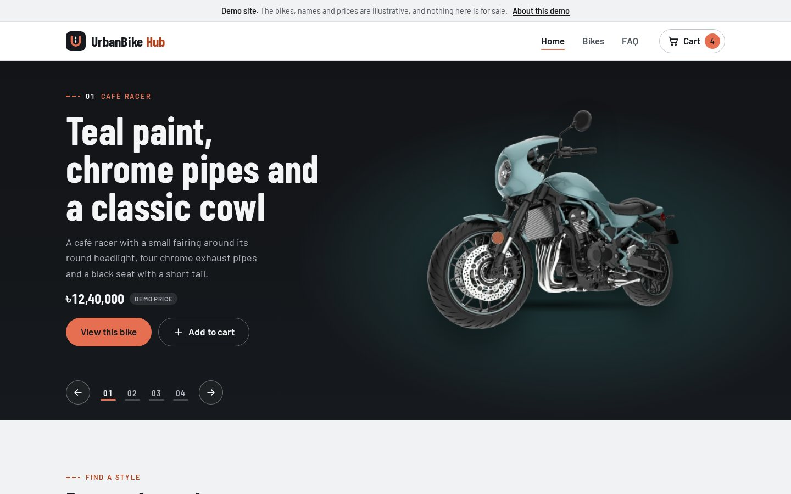
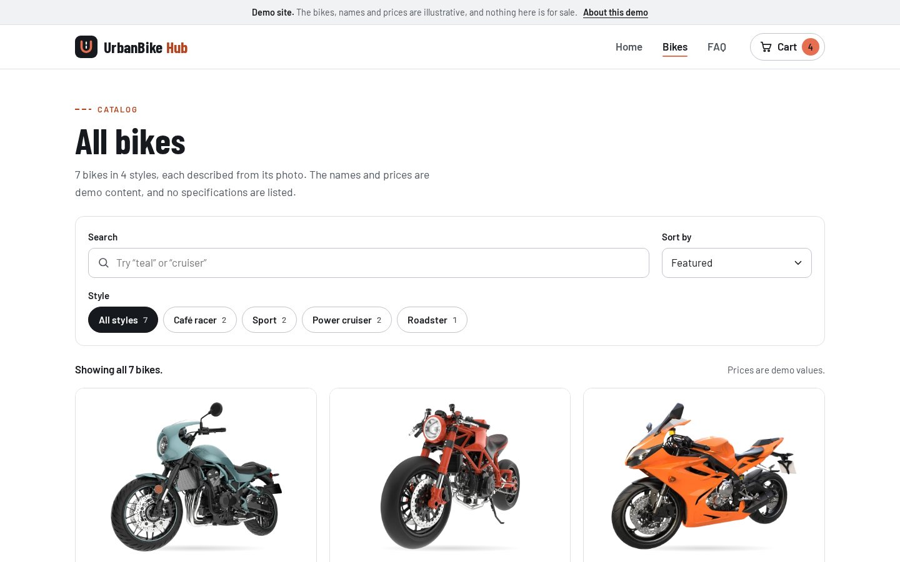
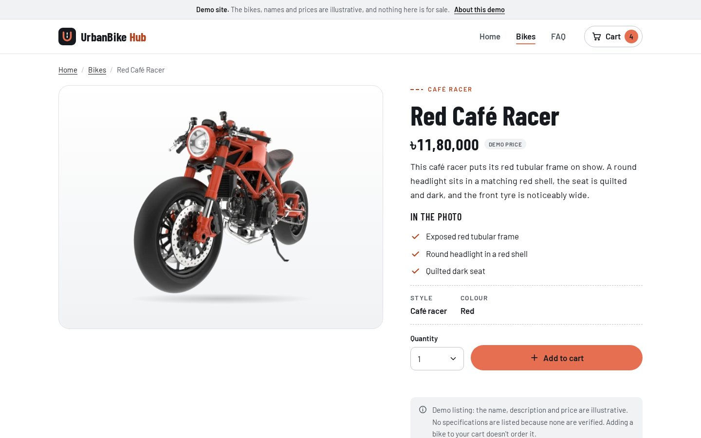
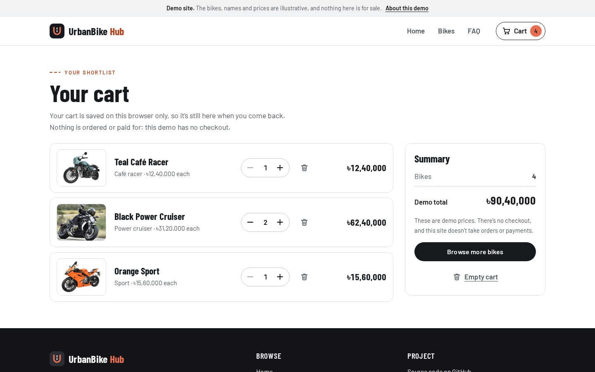
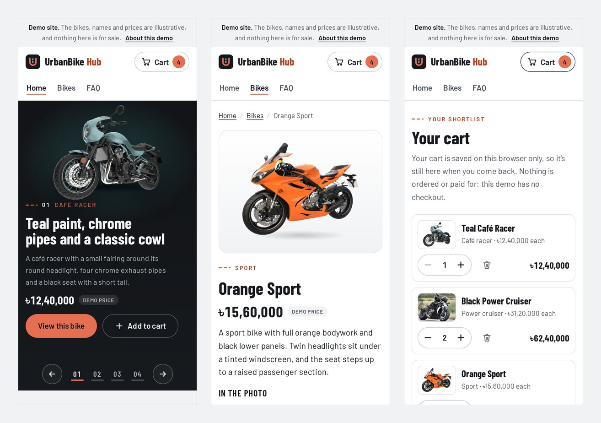

# UrbanBike Hub

A static website for browsing motorbikes. It has a featured-bike carousel, a catalog with search, style filters and sorting, a page for each bike, and a cart that's saved in your browser. It's a demo: the bike names, descriptions and prices are illustrative, and nothing on the site is for sale.

**Live site:** <https://shayan-abrar.github.io/UrbanBike-Hub/>

<p align="center">
  
</p>

<table>
  <tr>
    <td align="center" width="25%"><a href="screenshots/catalog.jpg"></a><br><sub><b>Catalog</b> · search, filter, sort</sub></td>
    <td align="center" width="25%"><a href="screenshots/bike.jpg"></a><br><sub><b>Bike details</b></sub></td>
    <td align="center" width="25%"><a href="screenshots/cart.jpg"></a><br><sub><b>Cart</b> · saved in the browser</sub></td>
    <td align="center" width="25%"><a href="screenshots/mobile.jpg"></a><br><sub><b>Phone</b> layouts</sub></td>
  </tr>
</table>

## Quick start

There's no build step and nothing to install. Serve the folder with any static web server:

```bash
git clone https://github.com/SHAYAN-ABRAR/UrbanBike-Hub.git
cd UrbanBike-Hub
python3 -m http.server 8000
```

Open <http://localhost:8000>. On Windows, use `python` instead of `python3`.

To preview it under the same `/UrbanBike-Hub/` path that GitHub Pages uses, run the server from the folder that contains the project instead:

```bash
cd ..
python3 -m http.server 8000
```

Then open <http://localhost:8000/UrbanBike-Hub/>. Python's server shows its own error page for missing paths. The custom `404.html` page only appears on GitHub Pages.

Use a local server rather than opening `index.html` directly. Browsers block the site's web fonts on `file://` pages, and some browsers don't keep `localStorage` for them, so the cart may not carry over between pages.

## Pages

- **Home (`index.html`):** a carousel of four featured bikes, each with its own headline, description and demo price. Swipe it on a touchscreen, or use the arrow buttons, the 01 to 04 buttons or the arrow keys. It never moves on its own. Below it: browse by style, the other three bikes, how the cart works and a FAQ.
- **Catalog (`bikes.html`):** all seven bikes. Search by name, style or colour (accents are ignored, so "cafe" finds "Café"), filter by one of four styles, and sort by featured order, demo price or name. The current search, style and sort are kept in the address, for example `bikes.html?style=sport&q=blue&sort=price-asc`, so a filtered view can be bookmarked or shared.
- **Bike details (`bike.html?id=…`):** a larger photo, a description of what the photo shows, a quantity menu (1 to 5) with **Add to cart**, and other bikes to look at. An unknown or missing id shows a "We couldn't find that bike" page with links back to the catalog.
- **Cart (`cart.html`):** see below.
- **Not found (`404.html`):** GitHub Pages shows this page for any path that doesn't exist.

## How the cart works

- The cart is saved in the browser's `localStorage` under the key `urbanbikehub:cart:v1`, in the form `{"v":1,"items":[{"id":"orange-sport","qty":2}],"savedAt":"…"}`. It's the only thing the site stores. Nothing is sent anywhere: there's no server, no account and no cookies.
- It's still there after a refresh or after closing and reopening the browser, on the same browser and device. Other browsers and devices have their own carts, a private window may not keep it, and clearing the site's data empties it.
- You can add up to 5 of each bike, change quantities, remove a bike (with **Undo**) and empty the whole cart (it asks first, and also offers **Undo**). The header shows how many bikes are in the cart, and other open tabs of the site update to match.
- The cart shows line totals and a demo total. Adding a bike doesn't order or reserve it. There's no checkout and no payment of any kind.
- Saved data is checked every time it's read. If it can't be read or comes from an older format, the cart is reset. Bikes that are no longer in the catalog are removed, entries with invalid quantities are removed, and quantities over 5 are lowered to 5. The cart page explains what changed, and the cleaned-up cart is saved so the message only appears once.
- If the browser blocks storage, the cart still works while the page is open, and the site says it won't be kept.

## What's demo content

- **Bike names** describe each photo by colour and style ("Teal Café Racer", "Black Power Cruiser"). They aren't make and model names.
- **Descriptions** only describe what's visible in each photo.
- **Prices** are made-up demo values in Bangladeshi taka (৳). The site labels them "Demo price" everywhere they appear.
- **No specifications, stock levels, reviews or ratings** are shown, because none of them are verified.
- The FAQ's "Riding basics" answers are general safety advice, not advice about particular bikes.

## Project structure

```text
index.html               Home: carousel, styles, more bikes, how it works, FAQ
bikes.html               Catalog
bike.html                Bike details (bike.html?id=…)
cart.html                Cart
404.html                 Not-found page for GitHub Pages (uses /UrbanBike-Hub/ paths)
assets/css/site.css      All styles
assets/js/data.js        The catalog: styles and bikes (names, demo prices, photos, alt text)
assets/js/cart.js        Reading, checking and saving the cart
assets/js/ui.js          Shared parts: bike cards, prices, header count, messages
assets/js/home.js        Home page and carousel
assets/js/catalog.js     Search, filters and sorting
assets/js/detail.js      Bike details page
assets/js/cart-page.js   Cart page
assets/img/bikes/        Bike photos (WebP)
assets/fonts/            Barlow and Barlow Condensed (WOFF2) with their licenses
screenshots/             Images used in this README
```

To change the catalog, edit `assets/js/data.js`. Each bike's `id` is used in its page address and in saved carts, so if you rename or remove an id, carts that contain it drop that bike with a notice.

## Accessibility

- Every control works with a keyboard and shows a visible focus outline. A "Skip to main content" link comes first on every page.
- The carousel only moves when asked. Slides that aren't showing are hidden from keyboard and screen-reader users, and the numbered buttons say which slide is current.
- Photos have descriptive alt text. Cart changes and "added" messages are announced to screen readers.
- Animations are turned off when the system is set to reduce motion.
- Without JavaScript, the home page still shows the four featured bikes, and the catalog, details and cart pages say they need JavaScript.

## Deploying

The site is plain HTML, CSS and JavaScript with relative links, so GitHub Pages can serve the repository as it is. The one exception is `404.html`: GitHub Pages serves it for missing paths at any depth, so its links start with `/UrbanBike-Hub/`. If the site moves to another path or a custom domain, update those links.

## Limitations

- It's a browsing demo, so there's no checkout, payment, stock or account system.
- The cart lives in one browser. It isn't synced between browsers or devices.
- The catalog is limited to the seven bike photos in the project.
- The catalog, details and cart pages need JavaScript.

## Tech stack

- HTML, CSS and JavaScript, with no framework, dependencies or build step
- Barlow and Barlow Condensed typefaces, self-hosted
- Hosted on GitHub Pages

## Credits

- **Typefaces:** Barlow and Barlow Condensed, Copyright 2017 The Barlow Project Authors, under the SIL Open Font License 1.1. The license files are in `assets/fonts/`.
- **Photos:** the motorcycle photos came with the original version of this project, and their sources aren't recorded.

## Contributing

Suggestions and bug reports are welcome. Please [open an issue](https://github.com/SHAYAN-ABRAR/UrbanBike-Hub/issues). Please read the license note below before reusing any code or images.

## License

This repository doesn't have a license yet, so it doesn't grant anyone permission to reuse or redistribute its code or images. Please ask before reusing any part of it.

---

Built by **Shayan Abrar** · [GitHub](https://github.com/SHAYAN-ABRAR) · [LinkedIn](https://www.linkedin.com/in/shayan-abrar/)
